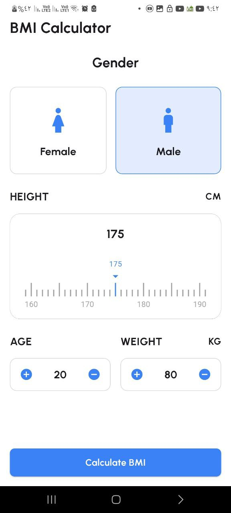
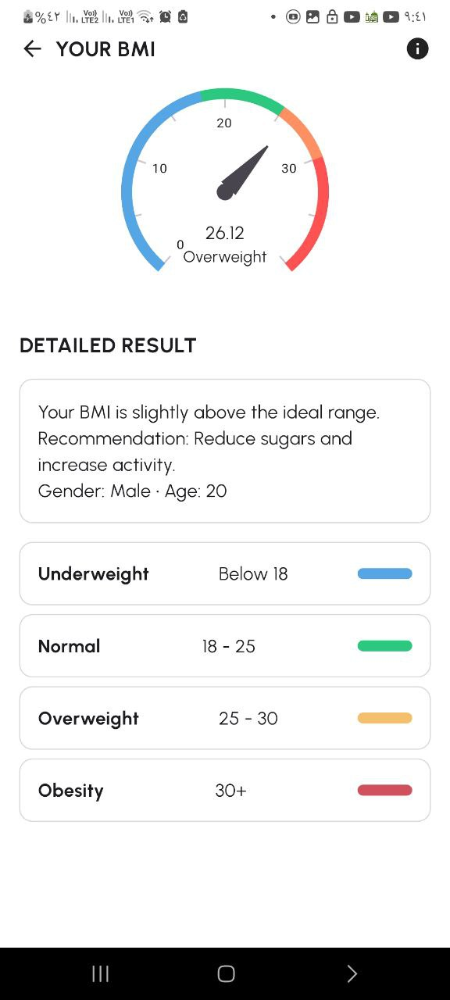

# BMI Tracker

**Track your Body Mass Index (BMI) easily with a modern, interactive UI!**

---

## 📱 App Features

* **BMI Calculation:** Enter height, weight, age, and gender to calculate BMI.
* **Interactive Gauge:** Visualize BMI using an animated gauge.
* **Detailed Health Results:** Recommendations and health risks based on your BMI.
* **Category Colors:** Underweight, Normal, Overweight, Obesity.
* **Responsive UI:** Works on all screen sizes using ScreenUtil.
* **MVVM Architecture:** Clean, maintainable code with Flutter Bloc.

---

## 🖼️ Screenshots

| Home Screen                                                               | Result Screen                                                                 |
| ------------------------------------------------------------------------- | ----------------------------------------------------------------------------- |
|  |  |

> Replace placeholders with actual screenshots from your app.

---

## 🛠️ Technologies & Packages

```yaml
dependencies:
  flutter:
    sdk: flutter
  bloc: ^9.1.0
  flutter_bloc: ^9.1.1
  cupertino_icons: ^1.0.8
  flutter_launcher_icons: ^0.14.4
  flutter_screenutil: ^5.9.3
  shimmer: ^3.0.0
  simple_ruler_picker: ^0.1.1
  syncfusion_flutter_gauges: ^31.2.18
```

* **Bloc & Flutter Bloc:** State management.
* **ScreenUtil:** Responsive UI design.
* **Syncfusion Gauges:** Interactive BMI gauge.
* **Shimmer:** Loading animations.
* **Simple Ruler Picker:** Height & weight input.

---

## 🏗️ Architecture

**MVVM (Model-View-ViewModel):**

* **Model:** Data structures for BMI and user info.
* **View:** Screens like Home, Result, Categories.
* **ViewModel:** Business logic using Bloc/Cubit.

---

## 📌 Usage

1. Clone the repo:

```bash
git clone <your-repo-url>
```

2. Install dependencies:

```bash
flutter pub get
```

3. Run the app:

```bash
flutter run
```

